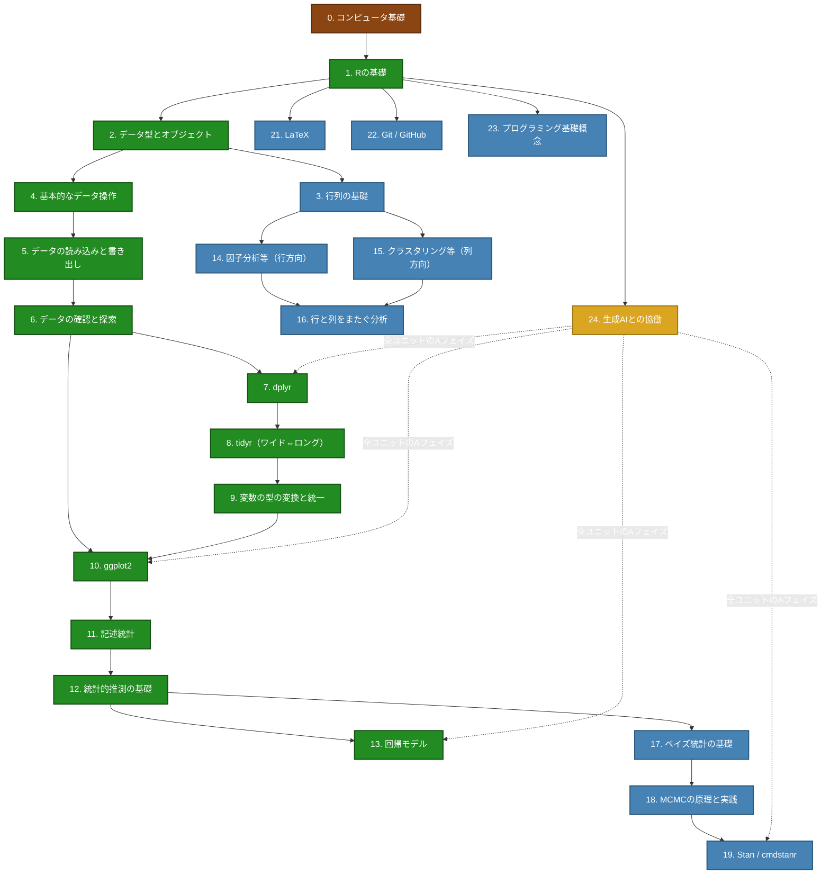

# kosugi-labo プロジェクト

## プロジェクト概要

- **公開URL**: https://kosugitti.github.io/kosugi-labo/
- **ローカル**: `~/Dropbox/Git/kosugi-labo/`
- **形式**: Quarto Website (GitHub Pages)
- **用途**: 小杉ゼミのWebサイト（ゼミガイド、技術ガイド、Rチュートリアル）

## サイト構成

```
kosugi-labo/
├── index.qmd                 # トップページ
├── members.qmd               # メンバー紹介
├── zemi-policy.qmd          # ゼミの運営方針・年間スケジュール
├── research-guide.qmd       # 研究の進め方
├── writing-guide.qmd        # 文章の読み書き
├── anti-harassment.qmd      # アンチハラスメントポリシー
├── server-status.qmd        # サーバー状況
├── feedback.qmd             # フィードバック
├── r-tutorial/              # Rチュートリアル（拡充対象）
│   ├── index.qmd
│   ├── r-basics.qmd
│   ├── data-handling.qmd
│   ├── tidyverse.qmd
│   └── visualization.qmd
└── tech-guide/              # 技術ガイド
    ├── github-setup.qmd
    ├── vscode-setup.qmd
    ├── ssh-remote.qmd
    ├── tailscale.qmd
    └── latex-setup.qmd
```

---

## shinyExametrika（Web分析ツール）

exametrika パッケージの Shiny GUI アプリケーション。コードを書かずにテストデータ分析（CTT, IRT, LCA, LRA, Biclustering 等）を実行・可視化できる。

| 接続元 | アクセスURL |
|--------|-----------|
| 学内（専修大学ネットワーク） | http://192.168.30.205/shinyExametrika/ |
| 学外 | https://kosugitti.shinyapps.io/shinyExametrika/ |

- 学内版は研究室サーバ Taniyama で稼働（Shiny Server + nginx）
- リポジトリ: `~/Dropbox/Git/shinyExametrika/`

---

## Rドリル改訂方針

### 元資料

- `~/Library/CloudStorage/Dropbox/Labo/Edu：講義資料/専修大学/ゼミオリエンテーション資料/CLAUDE.md` に全体設計あり
- `同フォルダ/Rdollil.tex` に現行版（200問、答え付き）あり
- `同フォルダ/作業ログ.md` に作業履歴あり

### 現行版の問題点（前回の反省）

- 2024年版: 100問の課題
- 2025年版: 生成AIサポートで200問に増加、マイクロステップ化
- **指示が具体的すぎて学生が考えなくなる/やる気をなくす**
  - 悪い例: 「`print("Hello, R World!")` を実行する」（答えを与えている）
  - 悪い例: 「椅子から立ち上がり、深呼吸を3回行う」

### 目標スキル

1. **データ整形技術**: 自分が欲しいデータの形にデータを整えることができる
2. **tidyverseマスター**: tidyverseを使った効率的なデータハンドリング
3. **データ可視化技術**: 研究に必要な図表を自在に作成できる
4. **生成AI活用力**: 俯瞰的ビジョンのもとで生成AIに適切な指示が出せる

### 新しいアプローチ: ゴールベース・ビジョン主導型

1. **可視化ギャラリーの提示**: 様々な図表のサンプルを見せ、目標を示す
2. **ゴールからの逆算学習**: 図を描きたい → 必要なデータ形式 → 整形方法
3. **段階的課題設計**:
   - Level 1: 基本的なデータ読み込み・確認
   - Level 2: 単純な可視化（散布図、ヒストグラム、棒グラフ）
   - Level 3: データ変形 → 可視化（集計後の可視化、グループ比較）
   - Level 4: 複雑なデータ整形 → 高度な可視化（facet、複数グラフの組み合わせ）
   - Level 5: 実践課題（研究論文レベルの図表作成）
4. **課題の提示方法**:
   - NG: 「`read_csv("data.csv")`を実行せよ」（答えを与えている）
   - OK: 「このデータファイルを読み込んで、どんな変数があるか確認しよう」
   - NG: 「`ggplot(data, aes(x=age, y=score)) + geom_point()`を実行」
   - OK: 「年齢とスコアの関係を散布図で可視化してみよう」

### 重視する新方向: アルゴリズム思考

- コード自体はAIで書ける時代 → プログラムの書き方だけでなくアルゴリズムを考える力を重視
- 「どう実装するか」ではなく「どう問題を分解し、手順を設計するか」
- 生成AIに的確な指示を出すためにも、問題の構造を理解する力が必要

### 教育デザイン: C/B/A 3フェイズ方式

各ユニットに3フェイズの課題を配置。ユニットの性質によってC/B/Aの厚みが変わる。

- **Cフェイズ（知識）**: 正誤問題・選択問題。「知っているか」を問う
- **Bフェイズ（技能）**: Rのコードを自分で書く。「手でできるか」を問う
- **Aフェイズ（応用）**: 生成AIに的確に指示して結果を得る。「問題を構造化し言語化できるか」を問う

学生の現在地を番号で把握できる自習教材（例: 「今7-B-3？あと少し!」）が目標。

#### ナンバリング規則

`ユニット番号-フェイズ-連番` 形式。例: `7-B-3` = ユニット7(dplyr)のBフェイズ3問目

- ユニット内では「B-3」と省略可（口頭での声かけ用）
- ユニットごとにC/B/Aの問題数は異なる（知識寄りのユニットはC多め、技能寄りはB多め等）
- 例: ユニット2(データ型) → 2-C-1 ~ 2-C-10, 2-B-1 ~ 2-B-3, 2-A-1
- 例: ユニット8(tidyr) → 8-C-1 ~ 8-C-3, 8-B-1 ~ 8-B-10, 8-A-1 ~ 8-A-5

#### 評価との関係

**基本方針**: ゼミの成績は基本全員80点。内容の充実度で加点（85, 90等）はあるが減点はしない。Rドリルの進捗は成績の加減点には直接使わない。最終評価は「プレ卒論」（卒論の問題と方法を書く課題）で行う。

**足切りライン（不可判定用）**: 不登校・サボり対策として、時期ごとの最低到達ラインを設ける。未達の場合は面談し、改善が見られなければ不可の候補。

| 時期 | 足切りライン | 意味 |
|------|-------------|------|
| 6月末 | U1~U6のCフェイズ完了 | Rの基礎知識がある。データを読んで眺められる |
| 9月末（夏休み明け） | U7~U10のCフェイズ完了 + U1~U6のBフェイズ完了 | dplyr/tidyr/ggplotを知っている。基礎操作は手で書ける |
| 11月末（プレ卒論前） | U7~U10のBフェイズ完了 | データ整形と可視化が自分の手でできる。プレ卒論に着手できる状態 |

- Cフェイズ（正誤問題）は自動採点可能 → 学生が自分でチェックできる
- Bフェイズ（コード）は提出またはゼミ中に確認
- Aフェイズ・枝ユニットは足切りに含めない（加点要素・自主的な伸びしろ）

#### 実装方式

**webexercises（Rパッケージ）をQuartoサイトに埋め込む方式で開始。**

- Cフェイズ: webexercisesで正誤/選択問題を各ページに埋め込み → ブラウザ上で即時フィードバック
- Bフェイズ: Quartoサイトに課題を表示 → ゼミ中に画面を見せてもらう or 提出で確認
- Aフェイズ: 課題をサイトに表示 → AIとの対話ログやスクリーンショットをゼミ中に共有
- 進捗把握: ゼミの時間に口頭で「今どこ？」と確認（番号で即答できる設計）
- サーバ不要、GitHub Pagesそのまま、学外からもアクセス可能

**選定理由**: 開発コスト最小。問題コンテンツの充実を優先し、進捗管理システムは後から必要に応じて追加（Google Forms等）。RStudioサーバは学内LAN限定のため、学外アクセスの問題を回避。

#### 将来ビジョン: ゲーム的UI・進捗モニタリング（検討中）

- **段階的開放**: ゲームのマップのように、次のステージが少しずつ出現する。最初から全体像は見せない
- **枝ユニット = サブクエスト**: 幹のメインクエストに対し、枝（LaTeX、Git、Stan等）はサブクエスト的な位置づけ
- **全体像のマップ表示**: マインドマップ的にスキルツリーの全体像を描画（進行に応じて開放）
- **双六的プログレスモニタ**: 各学生がどこまで進んでいるかを教師側から一覧できる仕組み
- **実装の課題**: 巨大なアプリになりうる。既存リソース（計算機サーバ、Google Classroom、GitHub等）の組み合わせで実現可能か要検討
- **現段階の方針**: まずwebexercisesでコンテンツを作り込む。UI/進捗管理は後回し

### スキルツリー: ユニット一覧と依存関係

#### 分類

- **根**: 前提知識。ゼミ以前に身についているべきだが怪しい学生もいる
- **幹**: 全員必須。これなしに卒論は書けない
- **枝**: 知っていると強い。研究テーマや手法によっては必須になる

#### ユニット一覧

| # | ユニット名 | 分類 |
|---|-----------|------|
| 0 | コンピュータ基礎（ファイル、パス、文字コード、OS） | 根 |
| 1 | Rの基礎（RStudio、プロジェクト、パッケージ、ヘルプ） | 幹 |
| 2 | データ型とオブジェクト（ベクトル、リスト、df、tibble、配列） | 幹 |
| 3 | 数学・行列の基礎（転置、積、相関行列、距離行列、固有値） | 枝 |
| 4 | 基本的なデータ操作（演算子、インデキシング、ソート） | 幹 |
| 5 | データの読み込みと書き出し（CSV、Excel、RDS） | 幹 |
| 6 | データの確認と探索（head、summary、str、table、欠損値） | 幹 |
| 7 | dplyr（filter、select、mutate、summarise、group_by等） | 幹 |
| 8 | tidyr: ワイド⇔ロング（tidy data、pivot_longer/wider、nest） | 幹 |
| 9 | 変数の型の変換と統一（ダミー変数、標準化、ワンホット） | 幹 |
| 10 | ggplot2（文法、geom、aes、facet、theme、保存） | 幹 |
| 11 | 記述統計（代表値、散布度、相関、効果量） | 幹 |
| 12 | 統計的推測の基礎（検定、信頼区間、検出力） | 幹 |
| 13 | 回帰モデル（lm、glm、モデル選択） | 幹 |
| 14 | 多変量解析・行方向（因子分析、PCA、SEM） | 枝 |
| 15 | 多変量解析・列方向（クラスタリング、MDS、判別分析） | 枝 |
| 16 | 行と列をまたぐ分析（バイプロット、対応分析、バイクラスタリング） | 枝 |
| 17 | ベイズ統計の基礎（事前/事後分布、信用区間） | 枝 |
| 18 | MCMCの原理と実践（chain、収束診断、Rhat） | 枝 |
| 19 | Stan / cmdstanr（モデル記述、fit、draws、bayesplot） | 枝 |
| 21 | LaTeX（数式、日本語、参考文献） | 枝 |
| 22 | Git / GitHub（バージョン管理、コミット、GitHub Pages） | 枝 |
| 23 | プログラミング基礎概念（関数定義、制御構造、apply/map） | 枝 |
| 24 | 生成AIとの協働（プロンプト、検証、エラー相談） | 幹（導入+全AフェイズにAI要素を組込） |

#### 依存関係図（Mermaid）



凡例: 茶=根 / 緑=幹 / 青=枝 / 金=AI / 点線=AIが各Aフェイズに浸透

#### 範囲外（別教材で扱い済み）

- 文書作成・再現可能研究 → Quarto/Rmdは別途指導
- 研究プロセス全体 → research-guide.qmd で扱い済み

### コンテンツ構成案（旧: 改訂予定）

- Part 1: 基礎の基礎（Rの基本操作）
- Part 2: データを読み込んで眺める
- Part 3: 可視化ギャラリー巡り
- Part 4: 図を描いてみよう（基礎編）
- Part 5: データを整形する（tidyverse入門）
- Part 6: 整形 → 可視化の連携
- Part 7: 高度な可視化への挑戦
- Part 8: 自由課題

※ 上記はユニット設計により再構成予定

### データセット

- BaseballDecade.csv（現行で使用中）
- その他、分析しやすく面白いデータセット（検討中）

### 可視化ギャラリーのソース候補

- ggplot2公式ギャラリー: https://ggplot2.tidyverse.org/
- R Graph Gallery: https://r-graph-gallery.com/
- 過去の優秀な卒論の図表

---

---

## 進捗管理システム構想（2026-02-14）

### 基本方針

学生ごとのGitHubリポジトリ（`~/Dropbox/Git/Zemi/StudentName/`）を活用し、学習進捗を可視化・管理する。

### システム構成

```
学生リポジトリ/
├── progress.yml              # 進捗データ（自動生成）
├── submissions/              # コード提出フォルダ
│   ├── U8/
│   │   ├── 8-B-1.R
│   │   ├── 8-B-2.R
│   │   └── ...
│   ├── U7/
│   └── ...
├── dashboard.qmd             # Quartoダッシュボード
├── .github/workflows/
│   └── render-dashboard.yml  # 自動レンダリング
└── docs/
    ├── index.html            # ダッシュボード（双六風マップ）
    └── input.html            # 進捗入力フォーム
```

### 学生の作業フロー

1. **課題を解く**: kosugi-laboのRドリルで学習
2. **コード提出**: ランクBの課題は`submissions/U8/8-B-1.R`にコードを保存
3. **進捗入力**: `docs/input.html`（GitHub Pages）でチェックボックスにチェック
4. **commit/push**: Gitでリポジトリに反映
5. **自動更新**: GitHub Actionsがダッシュボードを再レンダリング

### 進捗入力フォーム（input.html）

- **ランクC**: チェックボックスのみ（webexercisesで自己採点済み）
- **ランクB**: チェックボックス + **コードファイルアップロード必須**
- **ランクA**: チェックボックス + AIとの対話ログ・スクリーンショット（optional）
- 送信ボタン → GitHub API経由で`progress.yml`更新 + `submissions/`にファイル保存

### ダッシュボード（dashboard.qmd）

**可視化要素:**
- **双六風スキルツリーマップ**: visNetworkで24ユニットを階層表示
  - 完了ユニット: 緑
  - 進行中: 黄色
  - 未着手: 灰色
  - クリックでkosugi-laboの該当ページへリンク
- **ランク別進捗率**: C/B/Aの達成度を棒グラフ表示
- **次のマイルストーン**: 現在地と次の目標課題を表示
- **⚠️ 警告表示**: 「完了とマークされているがコードが提出されていない」課題をリストアップ

**信頼性チェック:**
```r
# progress.ymlで完了マークがあるが、submissions/にコードがない場合は警告
check_code_submission <- function(unit, rank, number) {
  code_file <- glue("submissions/{unit}/{unit}-{rank}-{number}.R")
  file.exists(code_file)
}
```

### 先生側の管理

- 各学生のリポジトリはprivate → 先生と当該学生のみアクセス可能
- GitHub Pages URL（`https://{student}.github.io/...`）でダッシュボード確認
- ゼミ中に「今どこ？」と聞くとき、学生がダッシュボードを画面共有
- 全学生の進捗を一括確認するスクリプト（optional）:
  ```r
  # Zemi/collect_progress.R
  students <- dir("~/Dropbox/Git/Zemi/", pattern = "^[A-Z]")
  all_progress <- map_dfr(students, ~{
    read_yaml(glue("~/Dropbox/Git/Zemi/{.x}/progress.yml"))
  })
  ```

### 技術スタック

- **GitHub Pages**: ホスティング（サーバ不要）
- **Quarto**: ダッシュボード生成
- **visNetwork (R)**: スキルツリーの可視化
- **GitHub Actions**: 自動レンダリング
- **Vanilla JS**: 進捗入力フォームのフロントエンド
- **GitHub API**: progress.yml更新、ファイルアップロード

### 未解決課題

- [ ] 進捗入力フォームでGitHub APIを叩く認証方法（Personal Access Token? GitHub App?）
- [ ] ファイルアップロードのサイズ制限・形式チェック
- [ ] ランクAの評価基準（コード提出なし、自己評価のみでOK？）
- [ ] スキルツリーの双六風デザイン（vis.jsのレイアウト調整 or 手描きSVG?）

### 将来の拡張案

- 学生間の匿名平均進捗率を表示（モチベーション向上）
- 所要時間トラッキング（各課題にどれくらい時間がかかったか）
- バッジ・実績システム（「全Cランククリア」「初のAランク達成」等）
- ゼミ全体のヒートマップ（どのユニットで詰まる学生が多いか）

---

## 進捗状況

### 全24ユニット完成（2026-03-09）

全ユニットのqmd作成・HTMLビルド・ナビゲーション設定が完了。

| # | ユニット | C | B | A | 備考 |
|---|---------|---|---|---|------|
| 0 | コンピュータ基礎 | 12 | 6 | 2 | psychometrics_syllabus素材ベース |
| 1 | Rの基礎 | 10 | 8 | 2 | |
| 2 | データ型とオブジェクト | 12 | 5 | 2 | パイロット版（2026-02-14） |
| 3 | 数学・行列の基礎 | 8 | 8 | 2 | |
| 4 | 基本的なデータ操作 | 10 | 8 | 2 | |
| 5 | データの読み書き | 8 | 8 | 2 | |
| 6 | データの確認と探索 | 10 | 8 | 2 | |
| 7 | dplyr | 10 | 10 | 3 | BaseballDecade.csv+iris |
| 8 | tidyr | 8 | 6 | 3 | パイロット版（2026-02-14） |
| 9 | 変数の型の変換と統一 | 8 | 8 | 2 | |
| 10 | ggplot2 | 10 | 10 | 2 | |
| 11 | 記述統計 | 10 | 8 | 2 | |
| 12 | 統計的推測の基礎 | 10 | 8 | 2 | ragg_png必須 |
| 13 | 回帰モデル | 10 | 10 | 2 | |
| 14 | 多変量・行方向 | 8 | 8 | 2 | semPlot eval=FALSE |
| 15 | 多変量・列方向 | 8 | 10 | 2 | smacof使用 |
| 16 | 行と列をまたぐ分析 | 7 | 8 | 2 | exametrika/qgraph eval=FALSE |
| 17 | ベイズ統計の基礎 | 10 | 8 | 2 | Beta-二項共役、Stan不使用 |
| 18 | MCMCの原理と実践 | 8 | 8 | 2 | 純R MHサンプラー |
| 19 | Stan / cmdstanr | 8 | 8 | 3 | 全Stan/cmdstanrコード eval=FALSE |
| 21 | LaTeX | 10 | 8 | 2 | tech-guide連携 |
| 22 | Git / GitHub | 8 | 8 | 2 | tech-guide連携 |
| 23 | プログラミング基礎概念 | 8 | 10 | 2 | apply/purrr |
| 24 | 生成AIとの協働 | 6 | 8 | 3 | 全Aフェイズの土台 |

**共通仕様:**
- 見出し: 「ランクC: 基礎知識」「ランクB: 実践スキル」「ランクA: AI協働」
- ナンバリング: `8-B-3`形式（口頭での声かけ用）
- ランクBの模範解答: `hide/unhide`で表示切替
- グラフ描画: `dev = "ragg_png"` で日本語対応
- 素材: PsyStatsPracticals、psychometrics_syllabus から引用・編集
- BaseballDecade.csvをdata/フォルダに配置
- webexercises設定完了（_quarto.ymlにCSS/JS追加）

### 次回のTodoリスト

**優先度: 高**
1. webexercisesが全ページで正しく動作するか確認
2. 各ユニットの内容精査・校閲（特にU1, U3-U6, U9-U11は一括生成のため要チェック）

**優先度: 中**
3. 可視化ギャラリーの作成
4. 進捗管理システムのプロトタイプ作成（学生リポジトリ1つでテスト）
5. BaseballDecade.csv以外のデータセット検討

**保留中**
- syllabus2026.texからSection 2,3,4を削除（Web移行済みのため）
