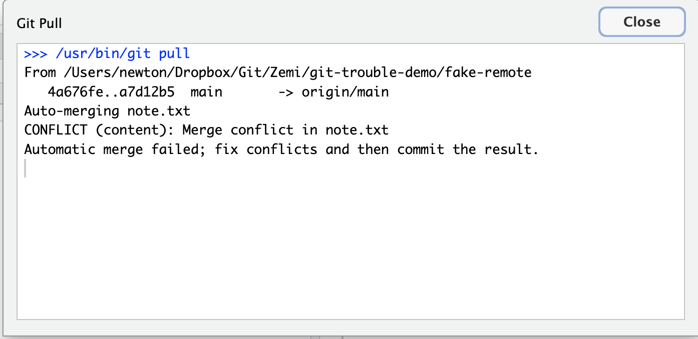
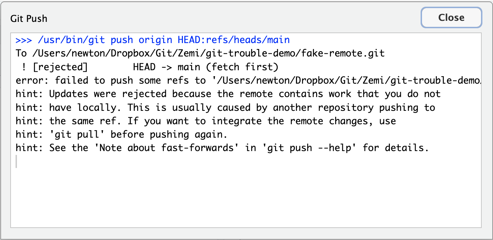
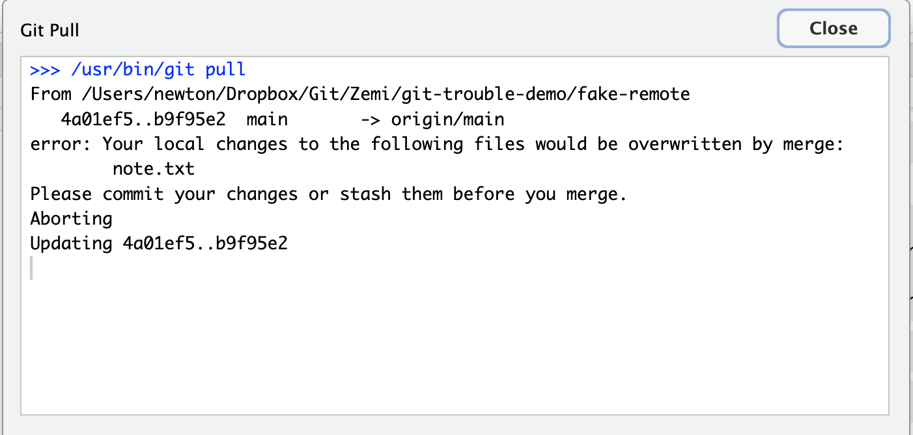

ゼミ活動では，毎週 RStudio から **Pull → 編集 → Commit → Push** を繰り返してもらっています。
ふだんは何事もなく流れる作業ですが，たまにエラーダイアログが赤字で出てきて固まってしまうことがあります。
このページは，そんなときに **何をすればいいか / 何を絶対しないか** をまとめたものです。

::: {.callout-important}
## まず最初に覚えてほしい3原則

1. **何もボタンを押さない**。特に `Force push` `Reset` `Revert` `Discard` は絶対に押さない。これらは元に戻せない破壊操作で，1週間分の作業が一瞬で消えることがあります。
2. **画面を見せる**。RStudio の Git タブ全体と，出ているエラーダイアログをスクリーンショット (Mac: `Cmd + Shift + 4`，Windows: `Win + Shift + S`) して，Discord か `Thesis/MeetingMemo.md` に貼ってください。
3. **自己判断でファイルを編集しない**。特に `<<<<<<< HEAD` `=======` `>>>>>>>` という見慣れない記号が入ったファイルは触らずそのままにしてください (これは Git が「ここで衝突したよ」と印をつけた跡で，消したつもりで残すと事故ります)。

困ったら **「止まる → スクショ → 助けを呼ぶ」**。
これだけ守っていれば，作業を壊すことはまずありません。
:::

## 通常のワークフロー (おさらい)

RStudio の右上 `Git` タブから:

1. **Pull** (下向き矢印アイコン)
2. ファイルを編集して保存
3. `Git` タブで変更ファイルにチェックを入れる (Stage)
4. **Commit** ボタン → メッセージを書いて Commit
5. **Push** (上向き矢印アイコン)

毎回 **Pull で始めて Push で終える** のが大原則です。
Pull を忘れて編集に入ると，後で説明する「Push が拒否される」エラーに高確率でぶつかります。

## よくあるエラー3パターン

### パターン1: Pull したらコンフリクトと言われた

#### こんな画面

Pull を押した後のダイアログに，赤字で次のような文字が含まれている:

```
CONFLICT (content): Merge conflict in path/to/file
Automatic merge failed; fix conflicts and then commit the result.
```

<!--  -->

#### 何が起きているか

同じファイルの **同じ行** を，あなたと他の誰か (先生 / 別のマシンの自分) が別々に編集して，Git がどちらを残すべきか判断できない状態です。

#### あなたがやること

- **何もしない**。
- スクショを撮って Discord か MeetingMemo に貼ってヘルプを呼んでください。
- 編集途中のファイルがあれば，**そのまま閉じずに**待ってください (上書き保存 / Commit / Push は絶対にしない)。

#### あなたが絶対やってはいけないこと

- ファイルに入っている `<<<<<<<` `=======` `>>>>>>>` を自分で消す
- `Discard` ボタンで変更を捨てる
- `Reset` で巻き戻す

これをやってしまうと，あなたか相手かどちらかの作業が完全に消えます。

---

### パターン2: Push したら拒否された

#### こんな画面

Push を押した後のダイアログに，次のような文字が含まれている:

```
! [rejected]        main -> main (fetch first)
error: failed to push some refs to '...'
hint: Updates were rejected because the remote contains work that you
hint: do not have locally.
```

<!--  -->

#### 何が起きているか

GitHub 側 (リモート) に，あなたのローカルにはまだないコミットが存在しています。
たいていは:

- 別のマシン (家のPC / 大学のPC) で先にコミット & プッシュしていた
- 先生がコメントを書いてプッシュしていた

のどちらかです。

#### あなたがやること

- まず **Pull** を押す (下向き矢印)。 リモートの新しい内容を取り込みます。
- Pull が成功して `Already up to date.` か `Fast-forward` のメッセージが出たら，もう一度 **Push** を押す。 これで通ります。
- もし Pull の途中でパターン1のコンフリクト画面に切り替わった場合は，パターン1の対応に従ってください。

#### あなたが絶対やってはいけないこと

- **「Force push」「強制プッシュ」のオプションを使わない**。 これはリモートにある相手のコミットを上書きで消す操作で，先生のコメントが消えたりします。

---

### パターン3: Pull しようとしたら「ローカルの変更が上書きされる」と言われた

#### こんな画面

Pull を押した後のダイアログに，次のような文字が含まれている:

```
error: Your local changes to the following files would be overwritten by merge:
        path/to/file
Please commit your changes or stash them before you merge.
```

<!--  -->

#### 何が起きているか

あなたが編集して **保存はしたけれど，まだ Commit していない変更** がローカルに残っている状態で，Pull しようとしました。
リモートにも同じファイルの変更があって，「いま Pull するとあなたの未コミット変更が消えるよ」と Git が止めてくれています。

#### あなたがやること

この3つの中で **唯一，学生が自力で解決できる** パターンです。

1. RStudio の `Git` タブで変更されているファイル (M マークが付いている) にチェックを入れる
2. **Commit** ボタンを押してメッセージを書いて Commit
3. もう一度 **Pull** を押す
4. (パターン1のコンフリクトに切り替わったら，そこから先は SOS)

つまり **先に Commit してから Pull する**。 これだけで通ります。

#### あなたが絶対やってはいけないこと

- `Discard` で変更を捨てる (あなたの編集が消えます)

## 絶対に押してはいけないボタン一覧

RStudio の Git タブと右クリックメニューに出てくるボタンのうち，次のものは **困った時に押すと状況が悪化** します:

| ボタン / 操作 | 何が起きるか |
|---|---|
| `Discard` (チェックボックスの右クリック) | 未コミットの編集が消える |
| `Revert` | コミット済みの変更が打ち消される |
| `Reset` (特に `--hard`) | 履歴ごと巻き戻る。 作業が消える |
| `Force push` / `--force` | リモートの他人のコミットを消す |
| Pull / Push ダイアログの「閉じる前にもう一度試す」連打 | 同じエラーが何度も出るだけ。 待たずに SOS |

困った時の正解は **何も押さずに助けを呼ぶ** です。

## SOS の出し方

エラーが出たら，次の3点を一緒に伝えてください:

1. **どのボタンを押したか**: 「Pull を押したら」「Push を押したら」のどちらか
2. **エラーダイアログのスクリーンショット**: RStudio の Git タブとダイアログが両方写っているとベスト
3. **直前にやっていた作業**: 「家でも編集してた」「U03B.R を保存しただけ」など，思い当たることを一行

宛先は **Discord の `#質問` か `Thesis/MeetingMemo.md` の「相談」** どちらでも構いません。
夜中でも構わないので，自分で何とかしようとせずに送ってください。

## 関連ページ

- [GitHub セットアップ](github-setup.html) — 初期設定はこちら
- [U22. Git / GitHub](../r-tutorial/U22-git.html) — Git の概念と基本ワークフロー
